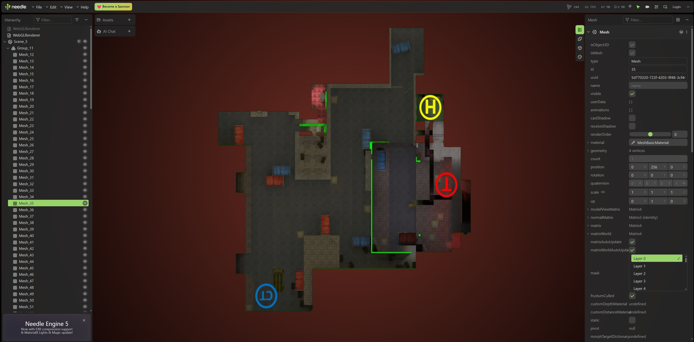

# Simple Map Engine (Three.js)

This is an example of a simple tile-based map engine built with **Three.js**.

It demonstrates how to render and interact with large tiled maps using WebGL, including zooming, panning, and multi-resolution tile loading.

---

## 🚀 Overview

This project is a lightweight map engine inspired by modern web mapping systems. It supports smooth navigation and layered tile rendering for different zoom levels.

---

## 🧩 Tech Stack

- **Rendering:** Three.js (https://github.com/mrdoob/three.js/)
- **Tile generation:** Python
- **HTTP server / backend:** Go (Golang)
- **Frontend bundling:** Webpack (JavaScript / CSS)

---

## 🗺️ Features

- Tile-based map rendering
- Multi-zoom level support
- Smooth zoom interpolation
- Camera-based panning
- WebGL accelerated rendering
- Lazy tile loading by viewport

---

## 🏗️ Architecture

- **Python toolchain** generates map tiles and organizes them by zoom levels (`/z/x/y.webp`)
- **Go server** serves static tiles and frontend assets efficiently
- **Webpack frontend** handles UI, rendering logic, and map interaction
- **Three.js** renders tiles in WebGL using an orthographic camera

---

## 📦 Tile Format

Tiles are stored using the standard XYZ structure:



## 🚀 Deployment Guide

### 1. Tile generation

First, you need to generate map tiles.

- Place your large map image into the `./tiler` directory.

Then run one of the following commands:

#### Windows
```bash
tiler.bat "map_name.{jpg,png,webp}" "new_folder_name"
```

#### Linux
```bash
./tiler.sh "map_name.{jpg,png,webp}" "new_folder_name"
```

After the tiles are generated, move the resulting folder into:

```bash
./public/assets
```

---

### 2. Frontend build

Install dependencies and build production assets:

```bash
npm install
npm run prod
```

---

### 3. Run the HTTP server

Build and start the server:

```bash
go build
./sme-http.exe
```
